## How to Build an n8n Workflow to Sync with Quire

### 1. Set Up the n8n Environment

Refer to the [official documentation](https://docs.n8n.io/hosting/) for setup instructions.

If you have Docker installed, you can run `./scripts/n8ndocker` to quickly start n8n.

After hosting the n8n server, open the n8n workspace. The default URL is `http://localhost:5678`.

### 2. Prepare a Quire App

> Reference: [Create Your Own App with Quire API](https://quire.io/blog/p/Create-Your-Quire-App-with-Quire-API.html)

To access the Quire API, you need to create and install a Quire app first.

Once the app is created, obtain the *Client ID* and *Client Secret* from the app settings. These credentials will be used for authentication.

### 3. Create a Workflow

> Reference: [Create a workflow](https://docs.n8n.io/workflows/create/)

Create a new workflow in the n8n workspace. Once created, you can start adding nodes.

### 4. Add an HTTP Node for API Requests

> Reference: [n8n HTTP Node](https://docs.n8n.io/integrations/builtin/core-nodes/n8n-nodes-base.httprequest/)

Start by adding an HTTP node. Set the request method and configure the node as needed.

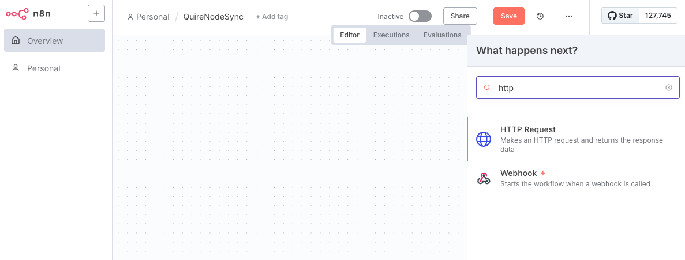

### 5. Authenticate with Quire

> Reference: [HTTP request credential](https://docs.n8n.io/integrations/builtin/credentials/httprequest/#using-bearer-auth)

Double-click the HTTP node to open its configuration. Choose `OAuth2 API` for Auth Type, and select `Create new credential` to set up authentication.

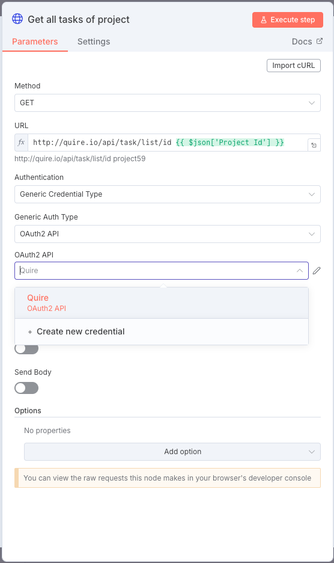

Fill in the following fields:

- `Authorization URL`: `https://quire.io/oauth`
- `Access Token URL`: `https://quire.io/oauth/token`
- `Client ID`: The client ID of your Quire App
- `Client Secret`: The client secret of your Quire App
- `Authentication`: `body`

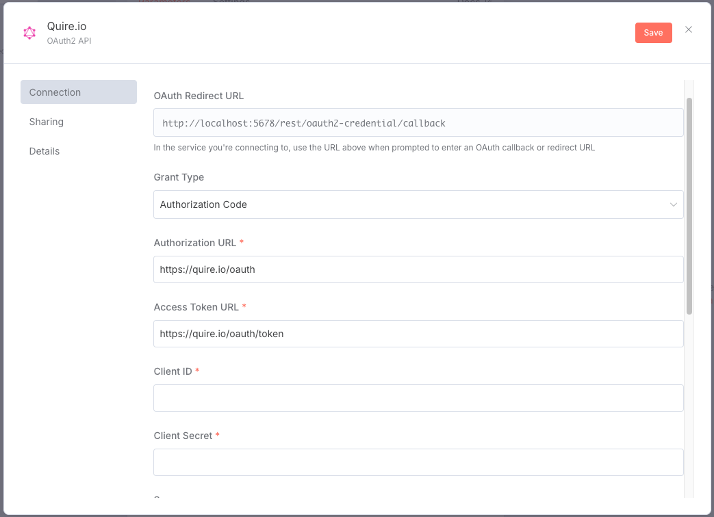

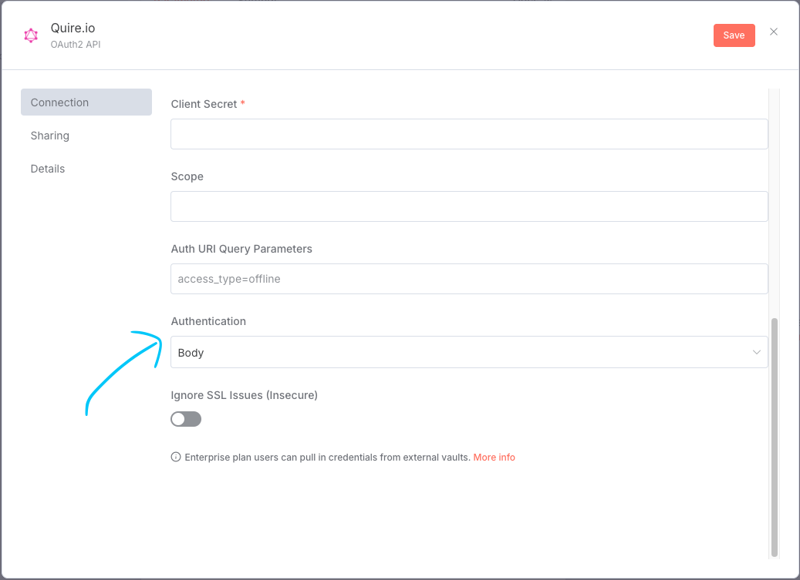

After completing the fields above, click `Connect my account`. This will redirect you to Quire for authorization.

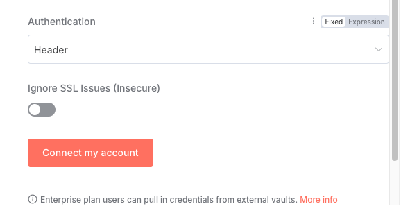

According to [n8n dev](https://apin8n.com/d/47-can-i-use-oauth2-apis-with-n8n), n8n automatically handles token refreshing when the access token expires, as long as the credential is set up correctly. No manual action is required for token renewal.

### 6. Send API Requests to Quire

Open the HTTP node configuration and set the request method as needed.

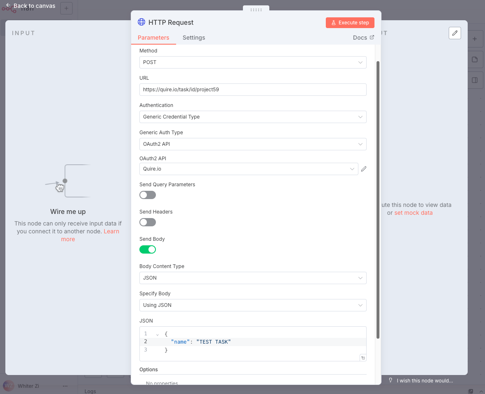

The `OAuth 2 API` field should reference the credential you created in [Step 5](#5-authenticate-with-quire). For example, this node will send a `POST` request to the Quire API to create a task named `TEST TASK`. For API details, refer to the [Quire API documentation](https://quire.io/dev/api/).

### 7. Receive Webhook Events from Quire

Quire supports sending webhook events when a project is updated. To receive these events in n8n, add a [Webhook Node](https://docs.n8n.io/integrations/builtin/core-nodes/n8n-nodes-base.webhook/) to your workflow.

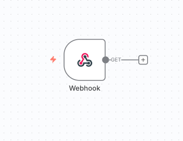

Double-click the node to open its configuration and copy the webhook URL for triggering events.

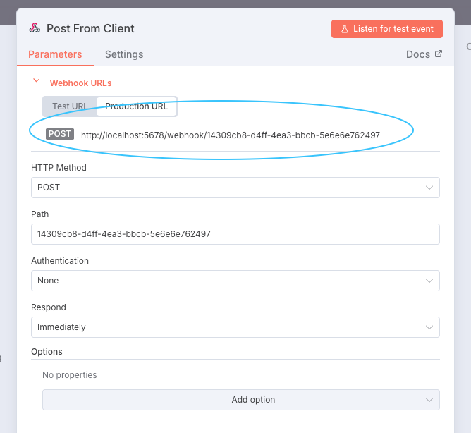

Paste this URL into your Quire App settings so Quire knows where to send update events.

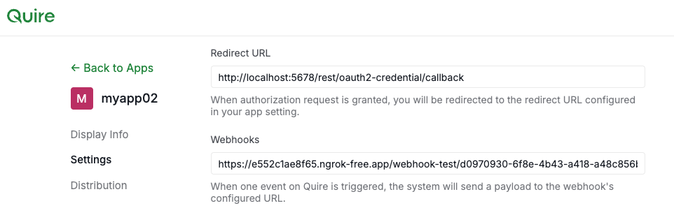

> NOTE: `localhost` is not a valid domain for Quire to call your webhook. For testing, use a hosting tool like [ngrok](https://ngrok.com/).

Also, to receive webhook events for a project, you need to add the Quire app as a follower to the project. Refer to the Quire API documentation for [Registration for Notifications](https://quire.io/dev/api/#registration-for-notifications).

Once the settings are complete, your webhook should be able to receive Quire events.

## Template

For demonstration, we have prepared a simple example of a two-way syncing flow.

You can download the template JSON file from [QuireNodeSync](./n8n-template/QuireNodeSync.json).

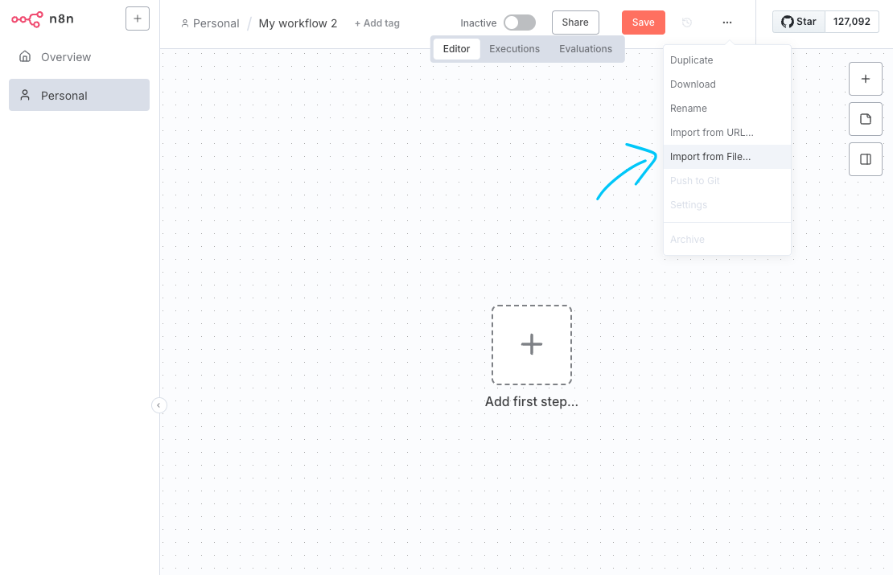

Go to your n8n workspace and import it into your workflow.

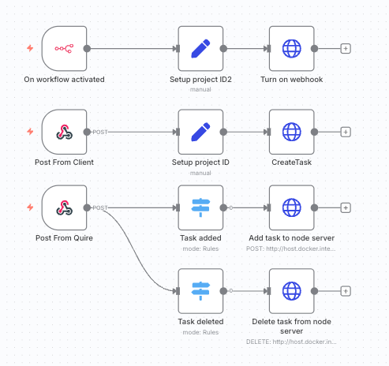

This template demonstrates two-way syncing between a local database and a Quire project.

### Setup
---

#### n8n Settings

First, edit the node named `Setup project ID` and set the project ID to your target project.

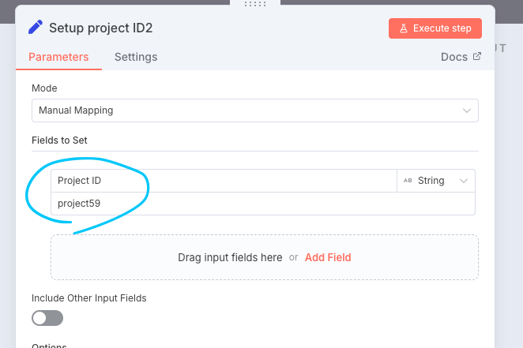

You can find the project ID in your project settings or in the project URL.

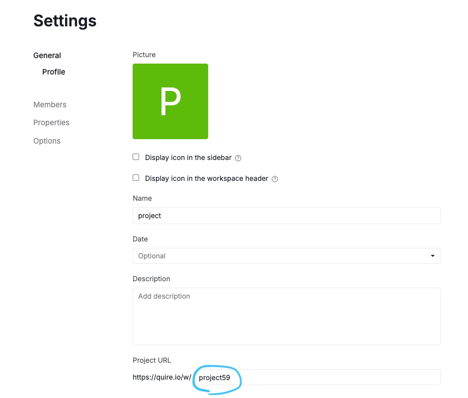

For example, the project ID here is `project59`.

---

#### Quire App

There are two `webhook` nodes in this template. To set up webhook events from Quire, open the configuration of the `Post From Quire` node and copy the webhook URL.


Paste this URL into your Quire App settings.


The URL should be `${your-n8n-host}/webhook/${path}`.

---

#### Node Server

To set up the node server, go to the root directory of this repository and run the following command to install the required dependencies:

```
npm install
```

Next, go to your n8n workspace, open the configuration of the `Post From Client` node, and copy the webhook URL of the node.


Open [server.ts](./demo/server.ts) and replace the value of `N8N_WEBHOOK_URL` with your webhook URL:

```ts
const N8N_WEBHOOK_URL = `${your-n8n-webhook-url}`
```

---

### Run Demo

After completing the setup, you can run the server using:
```
npm run start
```

The default page URL is `http://localhost:3000`.

Remember to activate the workflow template you just imported in your n8n workspace.

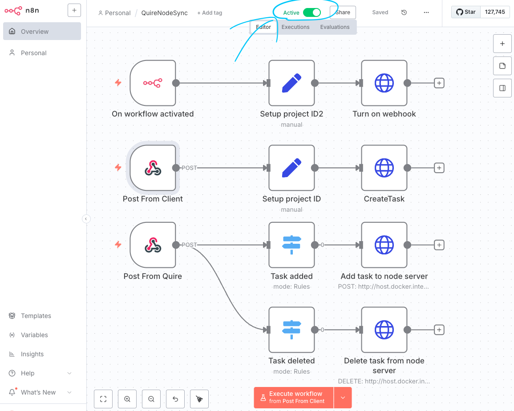

Now you can go to the node server page (`http://localhost:3000`) and try adding a task on the page or in the Quire project. The tasks should sync between the local page and the Quire project.

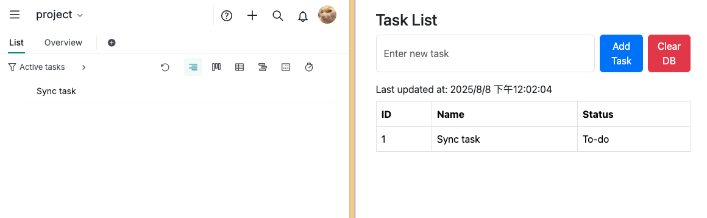