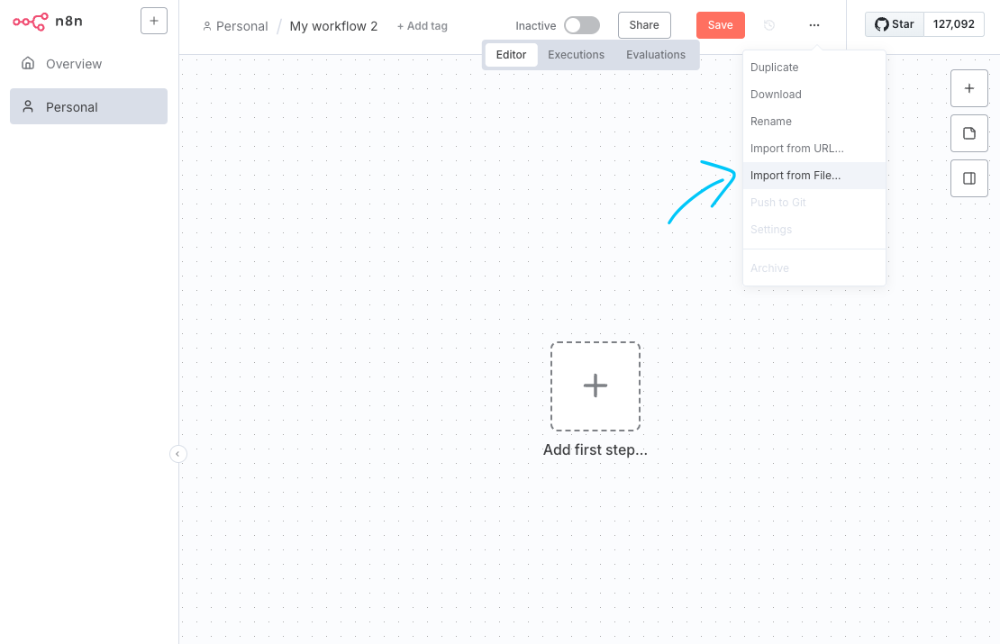
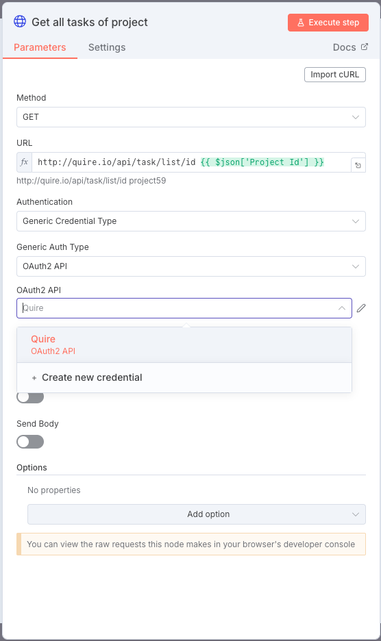
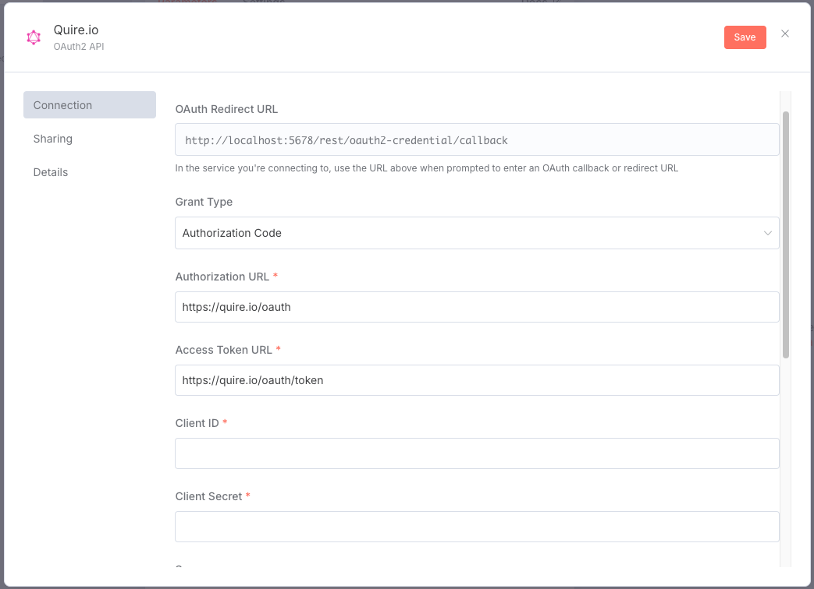
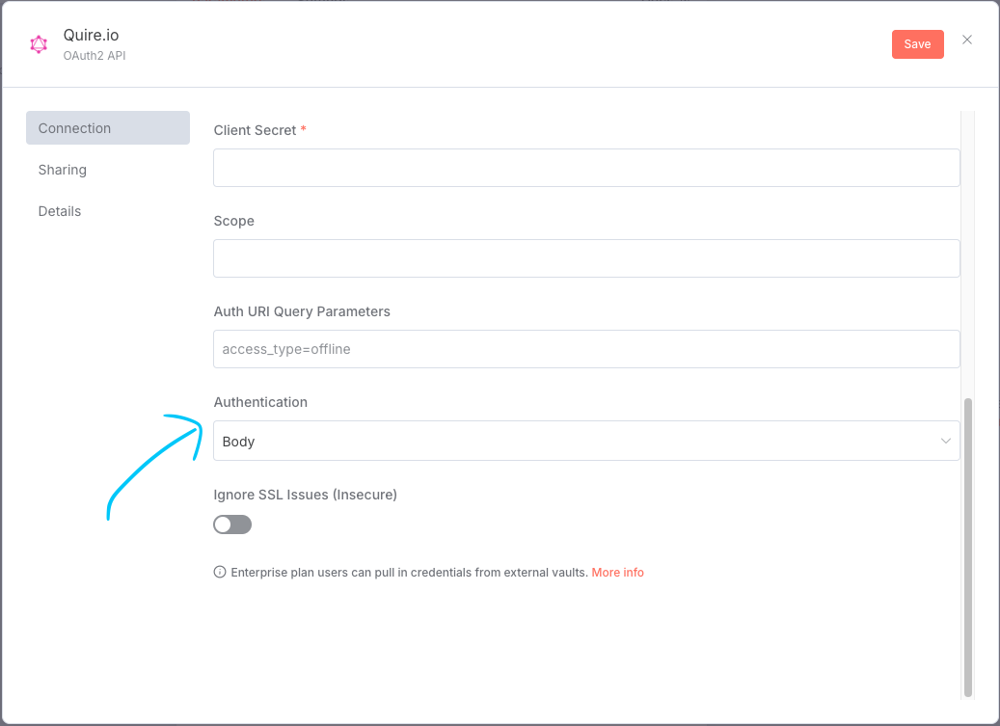
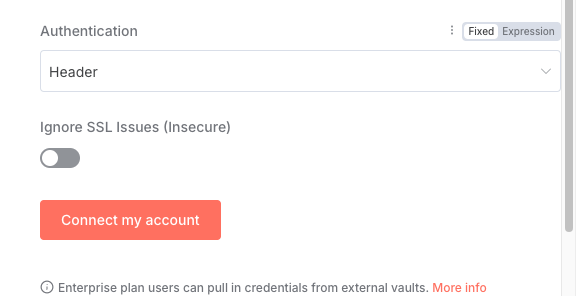
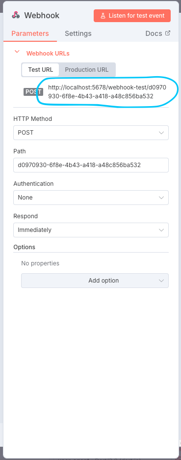
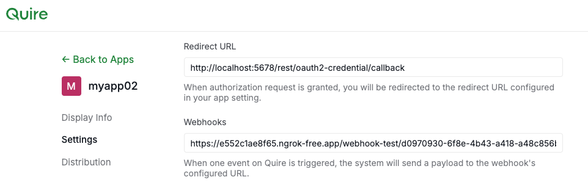
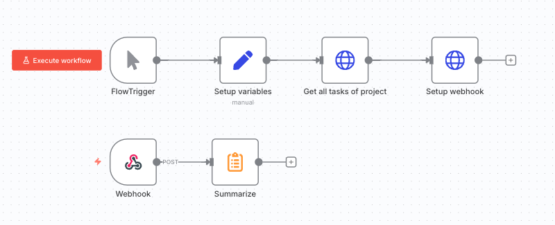

## How to Use the Quire Template for n8n

> To set up the n8n server, please refer to the [official documentation](https://docs.n8n.io/hosting/) or run `/scripts/n8ndocker`.

#### 1. Import Template
You can download the template from [Quire API Example](./Quire%20API%20Example.json).

Once you have the template, import it into your workflow by clicking `Import from file...`.

#### 2. Authenticate with Quire

Double-click the HTTP node to open its configuration.
Choose `OAuth2 API` for Auth Type, and select `Create new credential` to set up authentication.

You will see the settings dialog as shown below:

- `Authorization URL`: `https://quire.io/oauth`
- `Access Token URL`: `https://quire.io/oauth/token`
- `Client ID`: The client ID of your Quire App
- `Client Secret`: The client secret of your Quire App
- `Authentication`: `body`

Once the fields above are set, click `Connect my account`. This will lead you to Quire for authorization.

#### 3. Set Up Webhook

Open the configuration of the `webhook` node. You will need to copy the URL (circled in the image below) to your Quire app settings.

The URL should be `${your-host}/webhook/${path}`.

After completing all steps, add this Quire App as a follower to your Quire project. You can simply execute the workflow using the template node to do this.

Once the webhook is set, you can add a task in your project and see the output in n8n.